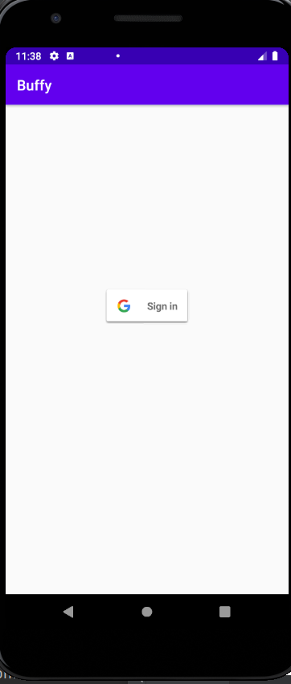
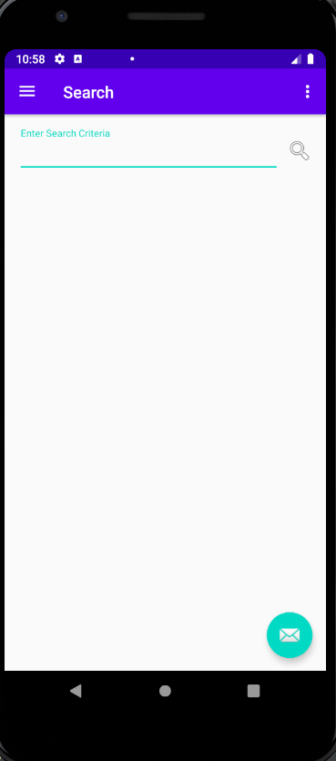
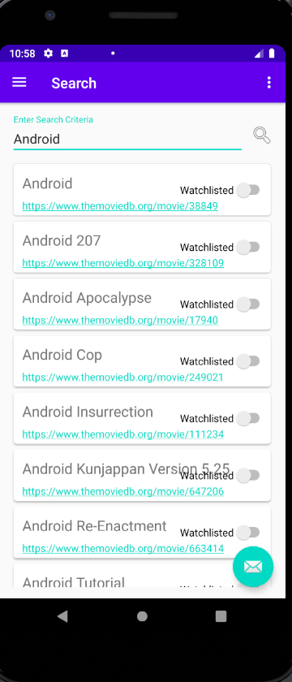
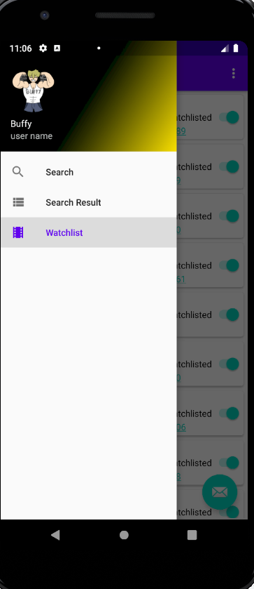
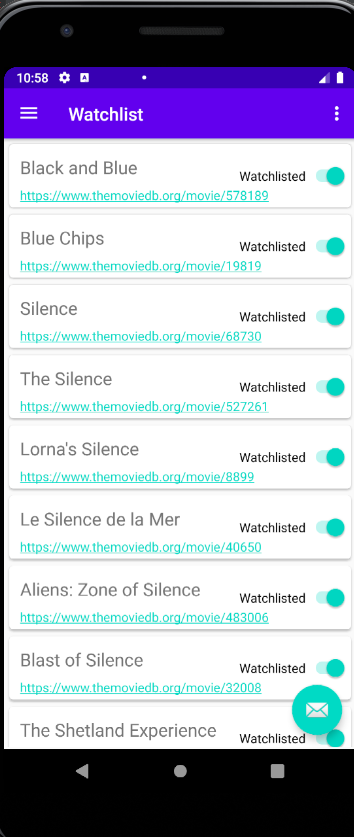

## Launch

* Start the app by launching the **Buffy** icon. 

* If this is the first time the app is launched after installation, a request to sign in using a Google email address and password is made.  _Buffy_ will not function without signing in. 

## Operation

* After signing in, the main screen of the app appears, which presents a search field, with a prompt to enter search criteria for a query through the TMDB database.  

* User may enter search criteria and click the magnifying glass to the right of the field.
  
* Search results from the query will be displayed, along with a url to the TMDB page containing more information about the title.

* User may click the "watchlist" switch to add any interesting titles to their watchlist.

* Click the "hamburger" menu at the top left, to pull out the navigation drawer to navigate to watchlist. 
 
* Clicking "watchlist" will bring up user's watchlist.  To remove a title from the watchlist, click the switch.
